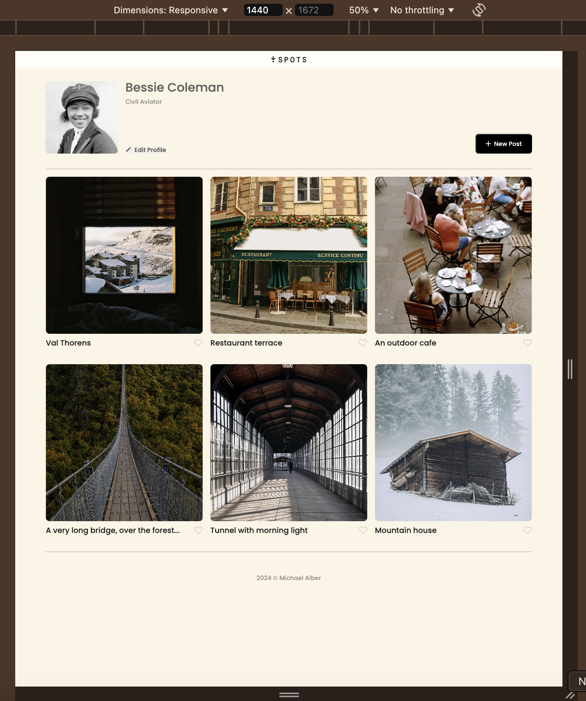
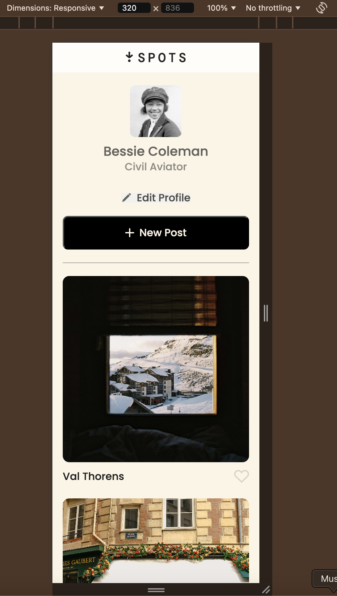

# Spots

An image sharing site with a gallery

## Description

A project to demonstrate proficiency in HTML, CSS, and responsive design.

## Screen Shots

Spots at 1440px wide

Spots at 320px wide

## Tech Stack

- HTML
- CSS
- Responsive design

## Deployment

This page is deployed to GitHub Pages

- [Deployment link][def]

[def]: https://malber71.github.io/se_project_spots/
